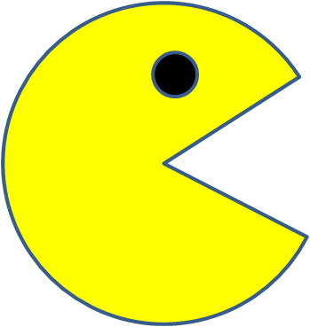

 
 
<pre> I'm a starter Fullstack Web Developer in training. <br><p><em> 
I joined MIT|XPRO course for the Full Stack Development with MERN in December 2021.
<details><summary>More...</summary>
<p>
It was the perfect gift for my New Year 22 from my husband. 
I have worked in IT for almost 10 years then decided to take a break from active career and 
enjoyed the time with kids, involved with their school and activities like secretory in PTA, running Chess club and volunteered. 
My daughter is now in 2nd year college and son senior year in high school. It's the perfect time for me to get back in IT world which 
i missed sometimes.
Our batch Dec2021 is the perfect class with full of curious minded women and I do enjoying the exercises. 
It was a fun to work on all these challenging projects and ready to take a flight again in IT market. 
Ofcourse we are doing more than these projects in day to day exercises but displaying my 3 projects over here as a part of the assignment.
Pacmen: Fun to watch them moving all over the screen and turning back from the walls.
Eye Exercise: Two big eyes follow the mouse movements.
Bus Tracker: On the map, it shows active buses live tracking with bus stop markers.

</p>
</details>
</em></p> </pre> 

## Table of Contents 

* [Installation](#installation)
* [Contact](#contact)
* [ReadMe for Projects](#readme)   
* [Projects](#projects)
* [Technologies](#technologies)
* [Github Stats and License](#stats) 


## README:
>
>ReadMe is a developer's profile project, where they'll be able to create their own portfolio and maintain a blog for their knowledge.
>
 <a href="https://github.com/NileemaS/github-readme-stats">
  
</a>
 
  
 
## Contact:  
 
- <a href="mailto:nileemashah@yahoo.com">Email Me </a>
- <a href="https://www.linkedin.com/feed/"> Connect Me </a> 
- 💼 Nileema Shah: [Portfolio](https://NileemaS.github.io/NileemaS)
- :octocat: Github: [Bio](https://www.github.com/NileemaS)


## Installation:
>
>This application is compatible with the most commonly used web browsers.
>


<!---
<details><summary>CLICK ME</summary>
<p>

#### We can hide anything, even code!

    ```ruby
      puts "Hello World"
    ```

</p>
</details>
--->


## Projects:

| Exercises | Click Icon to Play | Description | README |
| :---: | :---: | :---: | :------: |
| Home | [ 🏡 ](https://nileemas.github.io/profile/) | Profile Repository | [ Profile ReadMe](https://github.com/NileemaS/profile/blob/main/README.md) |
| PacMen | [](https://nileemas.github.io/pacmen/) | PacMen Factory Repository | [ Pacmen ReadMe](https://github.com/NileemaS/pacmen/blob/main/README.md) |
| Eye | [ 👀 ](https://nileemas.github.io/eye/) | Eye Exercise Repository | [ Eye ReadMe](https://github.com/NileemaS/eye/blob/main/README.md) |
| Bus Tracking | [ 🚌]( https://nileemas.github.io/bustracker/) | Real Time Bus Tracking Repository | [ Bus Tracker ReadMe](https://github.com/NileemaS/bustracker/blob/main/README.md) |


## Technologies:
<p>
    
    
    
    
   
</p>

 <p float="left">
  </p>
  
  
  
## Stats:


[](https://github.com/NileemaS/github-readme-stats)


<br>


### License ([^note]) 


[^note]:
    Copyrights @2022, All rights are reserved    
